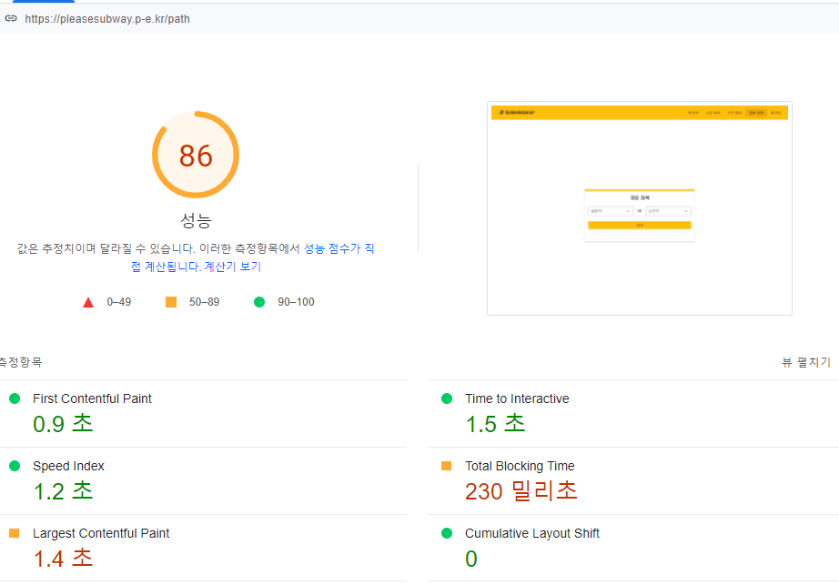
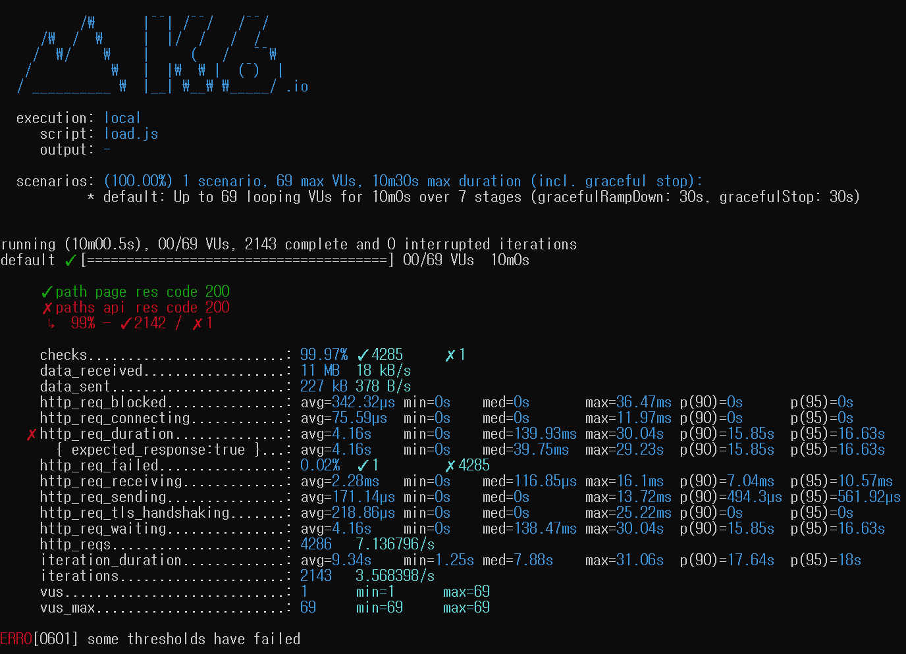
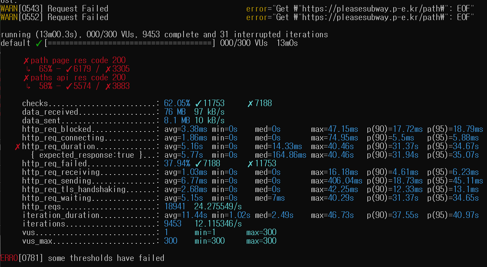

<p align="center">
    
</p>
<p align="center">
  
  
  <a href="https://edu.nextstep.camp/c/R89PYi5H" alt="nextstep atdd">
    
  </a>
  
</p>

<br>

# 인프라공방 샘플 서비스 - 지하철 노선도

<br>

## 🚀 Getting Started

### Install
#### npm 설치
```
cd frontend
npm install
```
> `frontend` 디렉토리에서 수행해야 합니다.

### Usage
#### webpack server 구동
```
npm run dev
```
#### application 구동
```
./gradlew clean build
```
<br>

## 미션

* 미션 진행 후에 아래 질문의 답을 작성하여 PR을 보내주세요.

### 1단계 - 인프라 운영하기
1. 각 서버내 로깅 경로를 알려주세요 <br>

admin 에서 ssh 로 접근 가능합니다. (전체 오픈해두었습니다.)  
(관리) admin: 13.209.73.178  
<br>(서버1) server-1
<br>(서버2) server-2
<br>둘 다 경로는 같습니다. 각각 file / json 파일이 있습니다.
<br>/home/ubuntu/infra-subway-monitoring/build/libs/log/

(리버스프록시 도커 nginx) reverse-proxy
<br>(docker nginx) access.log: /var/log/nginx/
<br>(docker nginx) error.log: /var/log/nginx/
<br>(docker nginx) cAdvisor: http://3.36.63.50:8080/  
<br>
(도커 DB) internal-1 <br>


2. Cloudwatch 대시보드 URL을 알려주세요    
   https://ap-northeast-2.console.aws.amazon.com/cloudwatch/home?region=ap-northeast-2#dashboards:name=DASHBOARD-itdar

---

### 2단계 - 성능 테스트
1. 웹 성능예산은 어느정도가 적당하다고 생각하시나요  
```
네이버지도, 카카오지도를 기준으로 웹페이지테스트와 페이지스피드인사이트를 비교했습니다.

- WebPageTest
                        기존          목표성능예산
Compress Transfer        F      ->      A     등급

- Page Speed Insights score (데스크톱 기준)  
                               기존           목표성능예산
Page Speed Insights score:      67      ->      80      점 이상
FCP(First Contentful Paint):    2.7     ->      0.6     sec 이하
TTI(Time to Interactive):       2.8     ->      0.8     sec 이하
Speed Index:                    3       ->      2.5     sec 이하
TBT(Total Blocking Time):       50      ->      20      ms 이하
LCP(Largest Contentful Paint):  2.8     ->      1       sec 이하
CLS(Cumulative Layout Shift):   0.003   ->      0.001   sec 이하
```

2. 웹 성능예산을 바탕으로 현재 지하철 노선도 서비스는 어떤 부분을 개선하면 좋을까요
```
다른 지표들은 거의 카카오와 네이버 지도를 상회하지만
Largest Contentful Paint 의 First View 시간이 오래걸리니,
 
gzip을 써서 압축한 내용을 response 받을 수 있게끔 개선하는게 좋을 것 같습니다.
```

3. 부하테스트 전제조건은 어느정도로 설정하셨나요
```
* 대상 시스템 범위
리버스프록시 서버에 들어오는 요청에서부터 DB를 조회하여 반응해주는 일련의 과정
 
* 목표
속도는 최적화가 더 잘 되었을 것으로 판단된 네이버지도/카카오 지도를 비교했으나, 
실사용 부하테스트는 지하철 관련 기능 한정으로 1위인 지하철종결자(어플리케이션) 을 참고했습니다.
(DAU는 90~ 120만, MAU는 410만, https://platum.kr/archives/61943)
  예상치
1. 예상 1일 사용자 수 (DAU): 100만
2. 피크 시간대의 예상 집중률: 5배 (500%) 
  -> 평일기준 출근/퇴근/약속후귀가
  -> 07~ 09, 17~ 19, 21~ 23시 (3회)
3. 1명당 1일 평균 접속 혹은 요청 수 예상: 평일기준 1일 2회 (출퇴근)
4. 예상 Throughput: 평균 23.1 rps~ 최대 115.5 rps 
  Throughput
  -> 2,000,000 = 1일 총 접속 수 = 1일 사용자 수 * 1명당 1일 평균 접속 수
  -> 23.1 rps = 1일 평균 rps = 1일 총 접속 수 / 86400(초/일)
  -> 115.5 rps = 1일 최대 rps = 1일 평균 rps * (최대 트래픽 / 평소 트래픽)
  Latency: 50ms 이하

* 시나리오
접속빈도가 높은 대상: 
  (메인페이지~ 경로 검색 페이지) 최초 메인페이지에서 경로 검색 페이지로 이동한다.
데이터를 조회하는데 여러 페이지를 참조하는 페이지: 
  (경로 검색 기능) 경로 검색 페이지에서 검색기능 사용한다.
```
4. Smoke, Load, Stress 테스트 스크립트와 결과를 공유해주세요
### 접속이 가장 많은 페이지 이동 (메인페이지~ 경로 검색 페이지로의 이동)
* Smoke
```
execution: local
script: smoke-highest-connection.js
output: -

        scenarios: (100.00%) 1 scenario, 1 max VUs, 35s max duration (incl. graceful stop):
* default: 1 looping VUs for 5s (gracefulStop: 30s)


running (06.1s), 0/1 VUs, 3 complete and 0 interrupted iterations
default ✓ [======================================] 1 VUs  5s

data_received..................: 12 kB  2.0 kB/s
data_sent......................: 1.1 kB 177 B/s
http_req_blocked...............: avg=5.25ms  min=8.04µs  med=8.1µs   max=31.49ms p(90)=15.75ms p(95)=23.62ms
http_req_connecting............: avg=66.96µs min=0s      med=0s      max=401.8µs p(90)=200.9µs p(95)=301.35µs
   ✓ http_req_duration..............: avg=4.38ms  min=3.45ms  med=4.32ms  max=5.32ms  p(90)=5.23ms  p(95)=5.27ms
{ expected_response:true }...: avg=4.38ms  min=3.45ms  med=4.32ms  max=5.32ms  p(90)=5.23ms  p(95)=5.27ms
http_req_failed................: 0.00%  ✓ 0   ✗ 6
http_req_receiving.............: avg=84.11µs min=70.83µs med=88.68µs max=91.68µs p(90)=91.66µs p(95)=91.67µs
http_req_sending...............: avg=35.82µs min=22.54µs med=34.54µs max=53.06µs p(90)=50.17µs p(95)=51.62µs
http_req_tls_handshaking.......: avg=4.5ms   min=0s      med=0s      max=27.05ms p(90)=13.52ms p(95)=20.29ms
http_req_waiting...............: avg=4.26ms  min=3.35ms  med=4.19ms  max=5.2ms   p(90)=5.12ms  p(95)=5.16ms
http_reqs......................: 6      0.989509/s
iteration_duration.............: avg=2.02s   min=2s      med=2.01s   max=2.04s   p(90)=2.03s   p(95)=2.03s
iterations.....................: 3      0.494755/s
vus............................: 1      min=1 max=1
vus_max........................: 1      min=1 max=1
```
* Load
```
execution: local
script: load-highest-connection.js
output: -

scenarios: (100.00%) 1 scenario, 150 max VUs, 2m0s max duration (incl. graceful stop):
* default: Up to 150 looping VUs for 1m30s over 5 stages (gracefulRampDown: 30s, gracefulStop: 30s)

running (1m31.0s), 000/150 VUs, 4161 complete and 0 interrupted iterations
default ↓ [======================================] 006/150 VUs  1m30s

data_received..................: 11 MB  122 kB/s
data_sent......................: 1.0 MB 11 kB/s
http_req_blocked...............: avg=85.47µs min=3.55µs  med=5.38µs  max=35.22ms  p(90)=7.81µs  p(95)=12.68µs
http_req_connecting............: avg=7.99µs  min=0s      med=0s      max=633.27µs p(90)=0s      p(95)=0s
   ✓ http_req_duration..............: avg=2.37ms  min=1.22ms  med=1.96ms  max=13.55ms  p(90)=3.41ms  p(95)=3.56ms
{ expected_response:true }...: avg=2.37ms  min=1.22ms  med=1.96ms  max=13.55ms  p(90)=3.41ms  p(95)=3.56ms
http_req_failed................: 0.00%  ✓ 0     ✗ 8322
http_req_receiving.............: avg=54.46µs min=20.71µs med=49.89µs max=705.8µs  p(90)=71.86µs p(95)=87.11µs
http_req_sending...............: avg=22.34µs min=9.61µs  med=18.69µs max=961.27µs p(90)=32.3µs  p(95)=42.56µs
http_req_tls_handshaking.......: avg=68.94µs min=0s      med=0s      max=29.47ms  p(90)=0s      p(95)=0s
http_req_waiting...............: avg=2.29ms  min=1.17ms  med=1.87ms  max=13.35ms  p(90)=3.33ms  p(95)=3.47ms
http_reqs......................: 8322   91.49374/s
iteration_duration.............: avg=2s      min=2s      med=2s      max=2.04s    p(90)=2s      p(95)=2s
iterations.....................: 4161   45.74687/s
vus............................: 6      min=6   max=150
vus_max........................: 150    min=150 max=150
```
* Stress
```
execution: local
script: stress-highest-connection.js
output: -

scenarios: (100.00%) 1 scenario, 800 max VUs, 2m55s max duration (incl. graceful stop):
* default: Up to 800 looping VUs for 2m25s over 12 stages (gracefulRampDown: 30s, gracefulStop: 30s)

running (2m26.3s), 000/800 VUs, 24019 complete and 0 interrupted iterations
default ↓ [======================================] 013/800 VUs  2m25s

     data_received..................: 202 MB 1.4 MB/s
     data_sent......................: 19 MB  128 kB/s
     http_req_blocked...............: avg=198.92ms min=0s    med=79.28ms  max=1.59s    p(90)=558.59ms p(95)=735.09ms
     http_req_connecting............: avg=34.48ms  min=0s    med=792.66µs max=823.13ms p(90)=124.64ms p(95)=182.51ms
   ✓ http_req_duration..............: avg=102.72ms min=0s    med=13.19ms  max=1.87s    p(90)=307.58ms p(95)=514.72ms
       { expected_response:true }...: avg=100.07ms min=1.2ms med=13.02ms  max=1.87s    p(90)=297.3ms  p(95)=505.81ms
     http_req_failed................: 2.66%  ✓ 1282  ✗ 46756
     http_req_receiving.............: avg=413.63µs min=0s    med=34.2µs   max=250.25ms p(90)=72.06µs  p(95)=124.15µs
     http_req_sending...............: avg=55.09ms  min=0s    med=174.82µs max=1.71s    p(90)=88.84ms  p(95)=426.81ms
     http_req_tls_handshaking.......: avg=128ms    min=0s    med=26.86ms  max=1.33s    p(90)=390.26ms p(95)=516.54ms
     http_req_waiting...............: avg=47.21ms  min=0s    med=11.17ms  max=1.53s    p(90)=147.02ms p(95)=223.42ms
     http_reqs......................: 48038  328.259342/s
     iteration_duration.............: avg=2.56s    min=2s    med=2.39s    max=5.28s    p(90)=3.38s    p(95)=3.73s
     iterations.....................: 24019  164.129671/s
     vus............................: 5      min=5   max=800
     vus_max........................: 800    min=800 max=800

```
------------
### 접속빈도가 높은 대상 (경로 검색 페이지에서 경로 검색 기능)
* Smoke
```
  execution: local
     script: smoke-path-search.js
     output: -

  scenarios: (100.00%) 1 scenario, 1 max VUs, 35s max duration (incl. graceful stop):
           * default: 1 looping VUs for 5s (gracefulStop: 30s)


running (05.1s), 0/1 VUs, 5 complete and 0 interrupted iterations
default ✓ [======================================] 1 VUs  5s

     data_received..................: 11 kB 2.1 kB/s
     data_sent......................: 971 B 191 B/s
     http_req_blocked...............: avg=8.11ms  min=7.23µs  med=8.24µs  max=40.51ms  p(90)=24.32ms  p(95)=32.41ms
     http_req_connecting............: avg=84.38µs min=0s      med=0s      max=421.9µs  p(90)=253.14µs p(95)=337.52µs
   ✓ http_req_duration..............: avg=2.82ms  min=1.85ms  med=2.66ms  max=4.01ms   p(90)=3.82ms   p(95)=3.91ms
       { expected_response:true }...: avg=2.82ms  min=1.85ms  med=2.66ms  max=4.01ms   p(90)=3.82ms   p(95)=3.91ms
     http_req_failed................: 0.00% ✓ 0   ✗ 5
     http_req_receiving.............: avg=72.84µs min=62.21µs med=73.3µs  max=86.79µs  p(90)=81.64µs  p(95)=84.21µs
     http_req_sending...............: avg=41.34µs min=21.55µs med=23.43µs max=108.04µs p(90)=77.62µs  p(95)=92.83µs
     http_req_tls_handshaking.......: avg=5.4ms   min=0s      med=0s      max=27.01ms  p(90)=16.2ms   p(95)=21.6ms
     http_req_waiting...............: avg=2.7ms   min=1.66ms  med=2.55ms  max=3.92ms   p(90)=3.72ms   p(95)=3.82ms
     http_reqs......................: 5     0.988015/s
     iteration_duration.............: avg=1.01s   min=1s      med=1s      max=1.04s    p(90)=1.02s    p(95)=1.03s
     iterations.....................: 5     0.988015/s
     vus............................: 1     min=1 max=1
     vus_max........................: 1     min=1 max=1
```
* Load
```
  execution: local
     script: load-path-search.js
     output: -

  scenarios: (100.00%) 1 scenario, 150 max VUs, 2m0s max duration (incl. graceful stop):
           * default: Up to 150 looping VUs for 1m30s over 5 stages (gracefulRampDown: 30s, gracefulStop: 30s)

running (1m30.6s), 000/150 VUs, 8239 complete and 0 interrupted iterations
default ✓ [======================================] 000/150 VUs  1m30s

     data_received..................: 11 MB  122 kB/s
     data_sent......................: 1.0 MB 11 kB/s
     http_req_blocked...............: avg=85.9µs  min=3.45µs  med=5.33µs  max=33.18ms p(90)=7.71µs  p(95)=12.14µs
     http_req_connecting............: avg=8.23µs  min=0s      med=0s      max=1.26ms  p(90)=0s      p(95)=0s
   ✓ http_req_duration..............: avg=2.36ms  min=1.24ms  med=1.96ms  max=9.29ms  p(90)=3.4ms   p(95)=3.53ms
       { expected_response:true }...: avg=2.36ms  min=1.24ms  med=1.96ms  max=9.29ms  p(90)=3.4ms   p(95)=3.53ms
     http_req_failed................: 0.00%  ✓ 0     ✗ 8239
     http_req_receiving.............: avg=54.71µs min=20.78µs med=49.52µs max=1.14ms  p(90)=72.09µs p(95)=86.31µs
     http_req_sending...............: avg=20.25µs min=9.81µs  med=14.75µs max=6.05ms  p(90)=28.73µs p(95)=41.48µs
     http_req_tls_handshaking.......: avg=69.27µs min=0s      med=0s      max=28.55ms p(90)=0s      p(95)=0s
     http_req_waiting...............: avg=2.28ms  min=1.18ms  med=1.87ms  max=9.05ms  p(90)=3.33ms  p(95)=3.45ms
     http_reqs......................: 8239   90.977182/s
     iteration_duration.............: avg=1s      min=1s      med=1s      max=1.03s   p(90)=1s      p(95)=1s
     iterations.....................: 8239   90.977182/s
     vus............................: 3      min=3   max=149
     vus_max........................: 150    min=150 max=150
```
* Stress
```
  execution: local
     script: stress-path-search.js
     output: -

  scenarios: (100.00%) 1 scenario, 800 max VUs, 2m55s max duration (incl. graceful stop):
           * default: Up to 800 looping VUs for 2m25s over 12 stages (gracefulRampDown: 30s, gracefulStop: 30s)

running (2m25.9s), 000/800 VUs, 47965 complete and 0 interrupted iterations
default ✓ [======================================] 000/800 VUs  2m25s

     data_received..................: 200 MB 1.4 MB/s
     data_sent......................: 19 MB  128 kB/s
     http_req_blocked...............: avg=195.73ms min=0s     med=72.3ms   max=1.75s    p(90)=577.8ms  p(95)=747.4ms
     http_req_connecting............: avg=29.86ms  min=0s     med=634.96µs max=963.94ms p(90)=104.91ms p(95)=180.73ms
   ✓ http_req_duration..............: avg=102.95ms min=0s     med=12.02ms  max=2.03s    p(90)=308.52ms p(95)=532.21ms
       { expected_response:true }...: avg=97.53ms  min=1.19ms med=11.86ms  max=2.03s    p(90)=295.57ms p(95)=510.81ms
     http_req_failed................: 2.48%  ✓ 1192  ✗ 46773
     http_req_receiving.............: avg=437.32µs min=0s     med=34.42µs  max=219.23ms p(90)=73.82µs  p(95)=131.67µs
     http_req_sending...............: avg=58.34ms  min=0s     med=115.61µs max=1.94s    p(90)=83.08ms  p(95)=445.45ms
     http_req_tls_handshaking.......: avg=125.92ms min=0s     med=22.38ms  max=1.35s    p(90)=402.37ms p(95)=534.09ms
     http_req_waiting...............: avg=44.17ms  min=0s     med=10.73ms  max=1.66s    p(90)=140.21ms p(95)=217.29ms
     http_reqs......................: 47965  328.820592/s
     iteration_duration.............: avg=1.27s    min=1s     med=1.11s    max=3.06s    p(90)=1.8s     p(95)=1.99s
     iterations.....................: 47965  328.820592/s
     vus............................: 5      min=5   max=800
     vus_max........................: 800    min=800 max=800
```
---------------------------------------------------

# 🚀 1단계 - 로깅과 모니터링
## 요구사항

* 애플리케이션 진단하기 실습을 진행해보고 문제가 되는 코드를 수정
* 로그 설정하기
* Cloudwatch로 모니터링

### 요구사항 설명
* 저장소를 활용하여 아래 요구사항을 해결합니다.
* README 에 있는 질문에 답을 추가한 후 PR을 보내고 리뷰요청을 합니다.
ㅐ### 로그 설정하기
* Application Log 파일로 저장하기
    * 회원가입, 로그인, 최단거리 조회 등의 이벤트에 로깅을 설정
* Nginx Access Log 설정하기
### Cloudwatch로 모니터링
* Cloudwatch로 로그 수집하기
* Cloudwatch로 메트릭 수집하기


## 힌트
### A. 로깅
#### *주의점
* Avoid side effects
    * logging으로 인해 애플리케이션 기능의 동작에 영향을 미치지 않아야 합니다.
    * 예를 들어 logging하는 시점에 NullPointerException이 발생해 프로그램이 정상적으로 동작하지 않는 상황이 발생하면 안됩니다.
* Be concise and descriptive
    * 각 Logging에는 데이터와 설명이 모두 포함되어야 합니다.
* Log method arguments and return values
    * 메소드의 input과 output을 로그로 남기면 debugger를 사용해 디버깅하지 않아도 됩니다. 특히 debugger를 사용할 수 없는 상황에서는 상당히 유용하게 사용할 수 있습니다.
    * 이를 구현하려면 메소드 앞 부분과 뒷 부분에 지저분한 중복 코드가 계속해서 발생하는 상황이 발생하는데 이는 AOP를 통해 해결할 수 있습니다.
* Delete personal information
    * 로그에 사용자의 전화번호, 계좌번호, 패스워드, 주소, 전화번호와 같은 개인정보를 남기지 않습니다.

#### *logging level
Logging Level을 적절하게 나눠 구현하는 것이 신경쓰면서 개발해야 합니다.
* ERROR : 예상하지 못한 심각한 문제가 발생하여 즉시 조사해야 함
* WARN : 로직상 유효성 확인, 예상 가능한 문제로 인한 예외처리 등을 남김, 서비스는 운영될 수 있지만, 주의해야 함
* INFO : 운영에 참고할만한 사항으로, 중요한 비즈니스 프로세스가 완료됨
* DEBUG / TRACE : 개발 단계에서만 사용하고 운영 단계에서는 사용하지 않음

* 즉, DEBUG 레벨로 설정하면 DEBUG 레벨보다 높은 로그 레벨의 메시지가 모두(DEBUG, INFO, WARN, ERROR) 출력됩니다. ERROR 레벨로 설정하면 ERROR 레벨의 로그만 출력되는 방식으로 동작합니다.

### B. Application Log
애플리케이션의 상태를 확인하기 위해서는 로그를 남기는 것이 중요합니다. 무엇을 로그로 남겨야 할지, 로그를 어떻게 관리해야 할지 고민해보며 학습해보세요.

> 스프링 Docs https://docs.spring.io/spring-boot/docs/2.2.7.RELEASE/reference/html/spring-boot-features.html#boot-features-logging  
> logback 공식 사이트  http://logback.qos.ch/documentation.html  
> 함께보면 좋을 자료 https://meetup.toast.com/posts/149  


* 예제 코드를 참고하여 미션을 진행합니다. https://github.com/woowacourse/java-deploy/tree/feat/logging  
#### a. logback.xml을 작성합니다.
  logback의 기본 설정 파일은 logback.xml 입니다. logback 라이브러리는 classpath 아래에 위치하는 logback.xml을 기본으로 찾아봅니다.
```java
<configuration debug="false">

    <!--spring boot의 기본 logback base.xml은 그대로 가져간다.-->
    <include resource="org/springframework/boot/logging/logback/base.xml" />
    <include resource="file-appender.xml" />

    <!--    logger name이 file일때 적용할 appender를 등록한다.-->
    <logger name="file" level="INFO" >
        <appender-ref ref="file" />
    </logger>
</configuration>  
```
```java
    <property name="home" value="log/" />

    <!--  appender이름이 file인 consoleAppender를 선언  -->
    <appender name="file" class="ch.qos.logback.core.rolling.RollingFileAppender">
        <!--로깅이 기록될 위치-->
        <file>${home}file.log</file>
        <!--로깅 파일이 특정 조건을 넘어가면 다른 파일로 만들어 준다.-->
        <rollingPolicy class="ch.qos.logback.core.rolling.TimeBasedRollingPolicy">
            <fileNamePattern>${home}file-%d{yyyyMMdd}-%i.log</fileNamePattern>
            <timeBasedFileNamingAndTriggeringPolicy class="ch.qos.logback.core.rolling.SizeAndTimeBasedFNATP">
                <maxFileSize>15MB</maxFileSize>
            </timeBasedFileNamingAndTriggeringPolicy>
        </rollingPolicy>
        <!--   해당 로깅의 패턴을 설정   -->
        <encoder>
            <charset>utf8</charset>
            <Pattern>
                %d{yyyy-MM-dd HH:mm:ss.SSS} %thread %-5level %logger - %m%n
            </Pattern>
        </encoder>
    </appender>
```
* logger: 실제 로그 기능을 수행하는 객체로 각 Logger마다 Name을 부여하여 사용합니다.

#### b. logback을 이용하여 logging을 찍어봅니다.
```java
    private static final Logger log = LoggerFactory.getLogger(Controller.class); 
    private static final Logger fileLogger = LoggerFactory.getLogger("file");
    
    ...
    log.error("An ERROR Message");
    fileLogger.info("파일 로깅 입니다.");
```


### C. Nginx Log
* volume 옵션을 활용하여 호스트의 경로와 도커의 경로를 마운트합니다.
> $ docker run -d -p 80:80 -v /var/log/nginx:/var/log/nginx nextstep/reverse-proxy


### D. 도커 상태 확인하기(cAdvisor 설치하기)
```
docker run \
  --volume=/:/rootfs:ro \
  --volume=/var/run:/var/run:ro \
  --volume=/sys:/sys:ro \
  --volume=/var/lib/docker/:/var/lib/docker:ro \
  --volume=/dev/disk/:/dev/disk:ro \
  --publish=8080:8080 \
  --detach=true \
  --name=cadvisor \
  google/cadvisor:latest
```

Docker로 운영하는 경우 cAdvisor를 활용하여 간단한 모니터링이 가능합니다.
* 호스트 리소스 모니터링에 필요한 디렉토리를 볼륨으로 지정
* 보안을 위해 읽기 전용으로 볼륨 지정
* 포트는 8080으로 오픈

### E. Cloudwatch로 수집하기
#### a. EC2에 IAM role 설정
  
  


 #### b. cloudwatch logs agent를 설치합니다.
```
$ curl https://s3.amazonaws.com/aws-cloudwatch/downloads/latest/awslogs-agent-setup.py -O

$ sudo python ./awslogs-agent-setup.py --region  ap-northeast-2
```
c. 로그 수집
```shell
$ vi /var/awslogs/etc/awslogs.conf

[/var/log/syslog]
datetime_format = %b %d %H:%M:%S
file = /var/log/syslog
buffer_duration = 5000
log_stream_name = {instance_id}
initial_position = start_of_file
log_group_name = [로그그룹 이름]

[/var/log/nginx/access.log]
datetime_format = %d/%b/%Y:%H:%M:%S %z
file = /var/log/nginx/access.log
buffer_duration = 5000
log_stream_name = access.log
initial_position = end_of_file
log_group_name = [로그그룹 이름]

[/var/log/nginx/error.log]
datetime_format = %Y/%m/%d %H:%M:%S
file = /var/log/nginx/error.log
buffer_duration = 5000
log_stream_name = error.log
initial_position = end_of_file
log_group_name = [로그그룹 이름]
```
> $ sudo service awslogs restart


#### d. Metric 수집
#### * EC2 Metric 수집
```
$ wget https://s3.amazonaws.com/amazoncloudwatch-agent/ubuntu/amd64/latest/amazon-cloudwatch-agent.deb
$ sudo dpkg -i -E ./amazon-cloudwatch-agent.deb
```
```shell
# /opt/aws/amazon-cloudwatch-agent/bin/config.json
{
        "agent": {
                "metrics_collection_interval": 60,
                "run_as_user": "root"
        },
        "metrics": {
                "metrics_collected": {
                        "disk": {
                                "measurement": [
                                        "used_percent",
                                        "used",
                                        "total"
                                ],
                                "metrics_collection_interval": 60,
                                "resources": [
                                        "*"
                                ]
                        },
                        "mem": {
                                "measurement": [
                                        "mem_used_percent",
                                        "mem_total",
                                        "mem_used"
                                ],
                                "metrics_collection_interval": 60
                        }
                }
        }
}
```
```
$ sudo /opt/aws/amazon-cloudwatch-agent/bin/amazon-cloudwatch-agent-ctl -a fetch-config -m ec2 -s -c file:/opt/aws/amazon-cloudwatch-agent/bin/config.json
$ sudo /opt/aws/amazon-cloudwatch-agent/bin/amazon-cloudwatch-agent-ctl -m ec2 -a status
{
  "status": "running",
  "starttime": "2021-03-20T15:12:07+00:00",
  "configstatus": "configured",
  "cwoc_status": "stopped",
  "cwoc_starttime": "",
  "cwoc_configstatus": "not configured",
  "version": "1.247347.5b250583"
}
```

* 위젯 추가 > 유형으로 행 선택 > 원본데이터로 지표 선택 > CPU Utilization, Network In / Out, mem_used_percent, disk_used_percent 등을 추가

  



#### * Spring Actuator Metric 수집
```
dependencies {
    implementation("org.springframework.boot:spring-boot-starter-actuator")
    implementation("org.springframework.cloud:spring-cloud-starter-aws:2.2.1.RELEASE")
    implementation("io.micrometer:micrometer-registry-cloudwatch")
}    
```
```
cloud.aws.stack.auto=false  # 로컬에서 실행시 AWS stack autoconfiguration 수행과정에서 발생하는 에러 방지
cloud.aws.region.static=ap-northeast-2
management.metrics.export.cloudwatch.namespace=  # 해당 namespace로 Cloudwatch 메트릭을 조회 가능
management.metrics.export.cloudwatch.batch-size=20
management.endpoints.web.exposure.include=*
```
--------------------------
# 🚀 2단계 - 성능 테스트
## 요구사항
* 웹 성능 테스트
  * 웹 성능 예산을 작성
  * WebPageTest, PageSpeed 등 테스트해보고 개선이 필요한 부분을 파악
* 부하 테스트
  * 테스트 전제조건 정리
    * 대상 시스템 범위
    * 목푯값 설정 (latency, throughput, 부하 유지기간)
    * 부하 테스트 시 저장될 데이터 건수 및 크기
  * 각 시나리오에 맞춰 스크립트 작성
    * 접속 빈도가 높은 페이지
    * 데이터를 갱신하는 페이지
    * 데이터를 조회하는데 여러 데이터를 참조하는 페이지
  * Smoke, Load, Stress 테스트 후 결과를 기록
## 힌트
### k6 설치
```
$ sudo apt-key adv --keyserver hkp://keyserver.ubuntu.com:80 --recv-keys C5AD17C747E3415A3642D57D77C6C491D6AC1D69
$ echo "deb https://dl.k6.io/deb stable main" | sudo tee /etc/apt/sources.list.d/k6.list
$ sudo apt-get update
$ sudo apt-get install k6
```
### Smoke Test
```
# smoke.js
import http from 'k6/http';
import { check, group, sleep, fail } from 'k6';

export let options = {
  vus: 1, // 1 user looping for 1 minute
  duration: '10s',

  thresholds: {
    http_req_duration: ['p(99)<1500'], // 99% of requests must complete below 1.5s
  },
};

const BASE_URL = '[Target URL]';
const USERNAME = 'test id';
const PASSWORD = 'test password';

export default function ()  {

  var payload = JSON.stringify({
    email: USERNAME,
    password: PASSWORD,
  });

  var params = {
    headers: {
      'Content-Type': 'application/json',
    },
  };


  let loginRes = http.post(`${BASE_URL}/login/token`, payload, params);

  check(loginRes, {
    'logged in successfully': (resp) => resp.json('accessToken') !== '',
  });


  let authHeaders = {
    headers: {
      Authorization: `Bearer ${loginRes.json('accessToken')}`,
    },
  };
  let myObjects = http.get(`${BASE_URL}/members/me`, authHeaders).json();
  check(myObjects, { 'retrieved member': (obj) => obj.id != 0 });
  sleep(1);
};
```
```
export let options = {
  stages: [
    { duration: '1m', target: 500 }, // simulate ramp-up of traffic from 1 to 100 users over 5 minutes.
    { duration: '2m', target: 500 }, // stay at 100 users for 10 minutes
    { duration: '10s', target: 0 }, // ramp-down to 0 users
  ],
  thresholds: {
    http_req_duration: ['p(99)<1500'], // 99% of requests must complete below 1.5s
    'logged in successfully': ['p(99)<1500'], // 99% of requests must complete below 1.5s
  },
};
```